# Requirements: Thara Energy Graduate Engineer Recruiting Agent

> Prototype สำหรับ IRIS P&O DDAI Case Assessment, **Option B: Agentic Recruiting Workflow**
> เอกสารนี้บอกว่า "ต้องสร้างอะไร" ส่วน "สร้างด้วยอะไร" อยู่ใน [techstack.md](techstack.md)

---

## 1. บริบท

**บริษัท:** Thara Energy (บริษัทสมมติ) เป็นบริษัทน้ำมันและก๊าซครบวงจรของไทย มีพนักงานราว 6,000 คน ธุรกิจครอบคลุม offshore E&P, refinery, petrochemical และ trading/retail

**ปัญหาที่เลือกแก้:** โครงการ Graduate Engineer Programme
- ได้ใบสมัครราว **5,000 ใบต่อปี สำหรับ 80 ที่นั่ง**
- Recruiter ใช้เวลา **หลายสัปดาห์** คัด CV ด้วยมือ
- Hiring manager บอกว่า **shortlist มักพลาดคนที่ใช่**
- บริษัทต้องการคนที่มีทักษะใหม่ด้าน data, digital และ sustainability เพื่อรองรับ energy transition แต่เกณฑ์คัดเลือกแบบเดิมยังเน้นแค่สาขาและเกรด

**สิ่งที่ CHRO ขอ:**
> "I want hiring that finds the right people faster, without losing human judgement. Show me something that works, not another report."

**Problem statement:**
ช่วย recruiter คัดผู้สมัครวิศวกรจบใหม่ได้ **เร็วขึ้น** **แม่นขึ้น** (ไม่พลาด hidden talent) และ **เป็นธรรมและตรวจสอบได้** โดยให้คนเป็นผู้ตัดสินใจทุกจุดสำคัญ

---

## 2. เป้าหมายและตัวชี้วัดความสำเร็จ

| # | เป้าหมาย | ตัวชี้วัดใน prototype | เกณฑ์ IRIS ที่ตอบ |
|---|---|---|---|
| G1 | คัดเร็วขึ้น | คัดผู้สมัคร 40 คนเสร็จภายในไม่กี่นาที แล้ว extrapolate เทียบกับเวลาคัดด้วยมือ | P&O understanding |
| G2 | ไม่พลาดคนเก่ง | hidden gem ที่ฝังไว้ในข้อมูลติด shortlist ทุกคน ขณะที่ keyword filter พลาด | P&O understanding, Data design |
| G3 | คนคุมการตัดสินใจ | มีจุดที่คนต้องอนุมัติ 2 จุด workflow เดินต่อเองไม่ได้ถ้าไม่มีการอนุมัติ | AI & workflow judgement |
| G4 | อธิบายผลได้ | ทุกคะแนนมีหลักฐานที่ยกมาจาก CV และเหตุผลรายเกณฑ์ | AI & workflow judgement |
| G5 | เป็นธรรมและตรวจสอบได้ | มี fairness check (4/5ths rule) และ audit log ครบทุก action | AI & workflow judgement |
| G6 | ใช้งานได้จริงครบ flow | กรรมการเปิดลิงก์แล้วเดินได้ตั้งแต่ต้นจนจบ แม้ไม่มี API key | Prototype that works |
| G7 | สื่อสารชัด | UI เข้าใจได้โดยไม่ต้องมีคนอธิบาย และสไลด์ 3–5 หน้าอ่านเข้าใจสำหรับคนที่ไม่ใช่สายเทคนิค | Communication |

---

## 3. ขอบเขต

### In scope
- ตำแหน่งเดียว: **Graduate Engineer Programme 2027 intake**
- Workflow 5 ขั้น และจุดที่คนอนุมัติ 2 จุด (ดู §6)
- Mock data: 1 JD, 1 success profile, ผู้สมัคร 40 คน, candidate tracker
- Explainability, fairness check, audit log
- Funnel dashboard
- ร่าง interview kit และ email (ไม่ส่งจริง)
- โหมด Demo (ใช้ผลที่ cache ไว้) และโหมด Live (เรียก Gemini จริง)

### Out of scope (ระบุไว้ในสไลด์ "What's next")
- ส่ง email จริงหรือต่อปฏิทินจริง
- Login หรือ SSO จริง (ใช้ role switcher แทน)
- Parse ไฟล์ CV เป็น PDF/DOCX (ใช้ CV เป็น text แทน)
- Candidate-facing chatbot
- เชื่อมต่อ ATS จริง (เช่น SuccessFactors หรือ Workday)
- Option A (workforce และ succession dashboard) ซึ่งเป็น roadmap ถัดไป

---

## 4. Assumptions (ระบุในสไลด์ด้วย)

| # | Assumption |
|---|---|
| A1 | CV ของผู้สมัครเป็นภาษาอังกฤษ ซึ่งเป็นเรื่องปกติของใบสมัครสายวิศวกรรมในไทย ส่วน UI ใช้ภาษาอังกฤษ |
| A2 | ผู้สมัคร 40 คนเป็นตัวอย่างย่อของใบสมัคร 5,000 ใบ ใช้ shortlist ratio ราว 25–30% ไปรอบสัมภาษณ์ |
| A3 | Hiring manager กับ recruiter เป็นคนละบทบาทกัน: HM อนุมัติเกณฑ์ ส่วน recruiter อนุมัติ shortlist |
| A4 | Knock-out criteria ใช้เฉพาะเงื่อนไขที่ตรวจสอบได้ชัดเจนและเกี่ยวกับงานโดยตรงเท่านั้น |
| A5 | ข้อมูลเพศ ภูมิภาค และกลุ่มมหาวิทยาลัยถูกเก็บแยก ใช้วิเคราะห์ความเป็นธรรมเท่านั้น ไม่ส่งให้ AI |
| A6 | Production ต้องใช้ Gemini แบบ paid tier หรือ Vertex AI ที่ไม่นำข้อมูลไปเทรน ส่วน free tier ใช้กับ mock data เท่านั้น |
| A7 | ข้อมูลทั้งหมดเป็นข้อมูลสมมติ ชื่อสุ่มประกอบขึ้น email ใช้โดเมน `example.com` |

---

## 5. ผู้ใช้ (Personas)

| Persona | ต้องการอะไร | ใช้หน้าไหน |
|---|---|---|
| **Hiring Manager** (เช่น Head of Process Engineering) | เกณฑ์ที่สะท้อนงานจริง และ shortlist ที่ไม่พลาดคนเก่ง | Success Profile |
| **Recruiter / TA** | คัดเร็ว มีเหตุผลรองรับ ไม่ต้องอ่าน CV ทุกใบ | Screening, Shortlist Review, Interview Kit, Tracker |
| **CHRO / P&O Lead** | ภาพรวม funnel ความเป็นธรรม และการตรวจสอบย้อนหลัง | Funnel, Fairness & Audit |
| **กรรมการ IRIS** | เปิดลิงก์แล้วเดินครบ flow ได้ในไม่กี่นาที | ทุกหน้า และมี guided demo ในหน้า Home |

---

## 6. Workflow ตั้งแต่ต้นจนจบ

```mermaid
flowchart LR
    JD[Job Description] --> S1[Step 1<br/>AI: JD → Success Profile]
    S1 --> H1{{HITL #1<br/>Hiring Manager<br/>approve criteria}}
    H1 -->|approved v1| S2a[Step 2a<br/>Rules: Knock-out]
    S2a --> S2b[Step 2b<br/>Code: PII redaction]
    S2b --> S2c[Step 2c<br/>AI: Evidence extraction]
    S2c --> S2d[Step 2d<br/>Code: Score + verify quotes]
    S2d --> S3[Step 3<br/>Code: Shortlist + borderline band]
    S3 --> H2{{HITL #2<br/>Recruiter<br/>approve / override + reason}}
    H2 -->|approved| S4[Step 4<br/>AI: Interview kit + emails]
    S4 --> S5[Step 5<br/>Code: Update tracker + audit log]
    S5 --> D[Funnel / Fairness / Audit dashboard]
```



**หลักการออกแบบ:** AI อ่านและเขียนภาษา ส่วนโค้ดคำนวณและตัดสินตามกฎ และคนเป็นผู้ตัดสินใจ

| งาน | ใครทำ | เหตุผล |
|---|---|---|
| แปลง JD เป็นเกณฑ์ | AI (คนอนุมัติ) | เป็นงานภาษา แต่มาตรฐานต้องมาจากคน |
| Knock-out | Rules | ต้องตรวจสอบได้ 100% ไม่ควรใช้ดุลยพินิจของ AI |
| ปิดบังข้อมูลส่วนตัว (PII) | Code | ต้องทำงานแน่นอนทุกครั้ง ก่อนข้อมูลถึง AI |
| ดึงหลักฐานจาก CV | AI | เป็นงานอ่านและเข้าใจภาษา ซึ่ง AI ทำได้ดี |
| คำนวณคะแนน | Code | คำนวณซ้ำได้ผลเดิม และอธิบายได้ |
| ตัดสินว่าใครได้สัมภาษณ์ | **คน** | เป็นการตัดสินใจที่มีผลต่อชีวิตผู้สมัคร |
| ร่างคำถามและ email | AI (คนตรวจ) | เป็นงานเขียนที่ต้องปรับให้เข้ากับแต่ละคน |

---

## 7. Functional Requirements

### 7.0 ทั่วไป
- **FR-0.1** หน้า Home อธิบายปัญหา แสดง flow diagram มีปุ่ม "Start guided demo" และบอกโหมดปัจจุบัน (Demo หรือ Live)
- **FR-0.2** Sidebar มี role switcher (Hiring Manager / Recruiter) ปุ่มอนุมัติแต่ละจุดใช้ได้เฉพาะ role ที่ถูกต้อง
- **FR-0.3** ปุ่ม "Reset demo" คืนข้อมูลกลับเป็นสถานะเริ่มต้น เพื่อให้กรรมการลองใหม่ได้
- **FR-0.4** ทุก action ที่เปลี่ยนสถานะต้องเขียนลง audit log (ดู §9)

### 7.1 Step 1: แปลง JD เป็น Success Profile (AI)
- **FR-1.1** แสดง JD ของ Graduate Engineer Programme ที่เตรียมไว้ และแก้ไข JD ได้
- **FR-1.2** AI สร้าง success profile เป็น JSON ตาม schema ประกอบด้วย:
  - **Knock-out criteria** (ผ่าน/ไม่ผ่าน) เช่น สาขาวิศวกรรมที่รับ, ปีที่จบ 2025–2027, ยินดีทำงาน rotation หรือ offshore, มีสิทธิ์ทำงานในไทย
  - **Scored criteria** 5–7 ข้อ แต่ละข้อมีชื่อ คำนิยาม น้ำหนัก (รวม 100) และ **behavioural anchors ระดับ 0–3**
- **FR-1.3** ค่าตั้งต้นของ scored criteria (HM ปรับได้):

| Criterion | Weight | หมายเหตุ |
|---|---|---|
| Technical foundation | 25 | ความรู้พื้นฐานตามสาขา วิชาที่เรียน และ thesis |
| Applied engineering experience | 20 | ฝึกงาน โปรเจกต์ ประสบการณ์ใน plant หรือภาคสนาม |
| Safety & operational mindset | 15 | HSE awareness ทำงานใน environment ที่มีความเสี่ยงได้ |
| Problem solving & data/digital | 15 | การวิเคราะห์ Python/MATLAB ข้อมูล และ automation |
| Energy transition orientation | 10 | CCS, hydrogen, renewables, decarbonisation |
| Collaboration & leadership | 10 | ทำงานเป็นทีม และบทบาทผู้นำในกิจกรรม |
| Communication | 5 | การสื่อสาร ภาษาอังกฤษ และการนำเสนอ |

- **FR-1.4** GPA ไม่ใช่ knock-out โดย default แต่ HM ตั้ง threshold ได้ (เช่น ≥ 2.50) โดยระบบแสดงคำเตือนว่าจะตัดผู้สมัครกี่คน และกระทบกลุ่มไหน
- **FR-1.5 (HITL #1)** Hiring Manager ต้องกด **Approve** success profile ก่อนจึงจะรัน Step 2 ได้ เมื่ออนุมัติแล้วระบบ lock เป็น version (v1, v2, …) ถ้าแก้หลังอนุมัติต้องสร้าง version ใหม่
- **FR-1.6** ระบบตรวจว่าน้ำหนักรวมเท่ากับ 100 และทุก criterion มี anchor ครบ 0–3 ก่อนอนุญาตให้อนุมัติ

### 7.2 Step 2: Screening
- **FR-2.1 Knock-out (rules):** ตรวจจาก structured fields ไม่ใช้ AI ผู้สมัครที่ไม่ผ่านได้สถานะ `Ineligible` พร้อมเหตุผลที่ระบุข้อชัดเจน
- **FR-2.2 PII redaction (code):** ก่อนส่ง CV ให้ AI ต้องลบหรือแทนที่ชื่อ email เบอร์โทร วันเกิดหรืออายุ เพศ คำนำหน้า (นาย/นางสาว/Mr/Ms) ชื่อมหาวิทยาลัย ที่อยู่ และรูป โดยแทนด้วย token เช่น `[CANDIDATE]` หรือ `[UNIVERSITY]`
- **FR-2.3** UI มีปุ่มดู "What the AI sees" ซึ่งแสดง CV หลังปิดข้อมูลส่วนตัวแล้ว
- **FR-2.4 Evidence extraction (AI):** AI ให้ผลต่อ criterion ดังนี้:
  - `level` (0–3) ตาม anchor
  - `evidence_quotes`: ข้อความที่ยกจาก CV ตรงตัว 1–3 ข้อความ
  - `rationale`: เหตุผล 1–2 ประโยค
  - `gaps`: สิ่งที่ยังไม่พบหลักฐาน
- **FR-2.5 Quote verification (code):** ตรวจว่า quote แต่ละข้อความอยู่ใน CV จริง (fuzzy match ≥ 90%) ถ้าไม่พบให้ติดป้าย `unverified` และให้ผู้สมัครคนนั้นเข้ากลุ่มที่คนต้องตรวจ
- **FR-2.6 Scoring (code):** `score = Σ weight × level / 3` ได้คะแนน 0–100 คำนวณซ้ำแล้วได้ผลเดิมเสมอ
- **FR-2.7 Prompt injection guard:** CV ถือเป็นข้อมูล ไม่ใช่คำสั่ง ถ้าพบข้อความที่พยายามสั่งให้ AI ให้คะแนน ให้ติด flag `suspicious_content` และ AI ต้องไม่เปลี่ยนการประเมินตามข้อความนั้น
- **FR-2.8** แสดง progress ระหว่างคัด และถ้าเรียก AI ไม่สำเร็จให้ retry แล้ว fallback ไปใช้ผลที่ cache ไว้ (ดู NFR)

### 7.3 Step 3: Shortlist (code)
- **FR-3.1** เรียงผู้สมัครที่ผ่าน knock-out ตามคะแนน
- **FR-3.2** แบ่งเป็น 3 กลุ่ม:
  - `Proposed`: Top N (ค่าตั้งต้น N = 12 ปรับได้)
  - `Needs Review`: คะแนนห่างจาก cutoff ไม่เกิน ±5, มี quote ที่ `unverified` หรือมี `suspicious_content`
  - `Not Proposed`: ที่เหลือ
- **FR-3.3 Baseline comparison:** แสดงผลของ keyword filter แบบที่ทำกันอยู่ เทียบกับผลของระบบนี้ และไฮไลต์ผู้สมัครที่ผลต่างกัน (เช่น hidden gem)

### 7.4 HITL #2: Recruiter Review
- **FR-4.1** หน้า Shortlist Review แสดงตารางผู้สมัคร โดยแต่ละคนมี:
  - คะแนนรวม
  - กราฟแท่งคะแนนรายเกณฑ์
  - evidence quotes ไฮไลต์ใน CV
  - gaps
  - flags
- **FR-4.2** Recruiter เลือกได้ว่า **Approve for interview / Reject / Hold** สำหรับแต่ละคน หรือ bulk approve กลุ่ม Proposed ได้
- **FR-4.3 Override:** ถ้าตัดสินต่างจากที่ระบบเสนอ (เช่น reject คนที่อยู่ใน Proposed หรือ approve คนที่อยู่ใน Not Proposed) **ต้องกรอกเหตุผล** (ขั้นต่ำ 10 ตัวอักษร) และเลือก reason code
- **FR-4.4** ทุกคนในกลุ่ม Needs Review ต้องได้รับการตัดสินก่อน จึงจะ "Confirm shortlist" ได้
- **FR-4.5** Step 4 จะรันได้ก็ต่อเมื่อ confirm shortlist แล้วเท่านั้น

### 7.5 Step 4: Interview Kit และ Outreach (AI)
- **FR-5.1** สำหรับผู้สมัครที่ approved ให้สร้าง interview kit:
  - คำถาม 5–6 ข้อ ที่ **เจาะ gaps** และยืนยันหลักฐานของผู้สมัครคนนั้น
  - แต่ละข้ออ้างอิง criterion และมีตัวอย่างลักษณะคำตอบที่ดี
- **FR-5.2** สร้างร่าง email:
  - **Invite** สำหรับคนที่ approved โดยปรับเนื้อหาให้เข้ากับแต่ละคน
  - **Regret** สำหรับคนที่ rejected โดยสุภาพและไม่เปิดเผยคะแนน
- **FR-5.3** Recruiter แก้ไขร่างได้ก่อนกด "Mark as sent" (ไม่ส่งจริง)
- **FR-5.4 (Nice to have):** เสนอ interview slot จากปฏิทินจำลอง

### 7.6 Step 5: Tracker และ Dashboard
- **FR-6.1** Candidate tracker แสดงสถานะล่าสุดของทุกคน กรองและค้นหาได้ และ export เป็น CSV ได้
- **FR-6.2** สถานะเปลี่ยนตาม state machine เท่านั้น:

```
Applied → Ineligible
Applied → Screened → {Proposed | Needs Review | Not Proposed}
{Proposed | Needs Review | Not Proposed} → {Approved | Rejected | On Hold}   (HITL #2 เท่านั้น)
Approved → Invited → Interview Scheduled
Rejected → Regret Sent
```

- **FR-6.3 Funnel dashboard:** แสดงจำนวนผู้สมัครแต่ละขั้น, conversion rate, เวลาที่ใช้ (ระบบเทียบกับคัดด้วยมือ) และ extrapolate ไปที่ 5,000 ใบ
- **FR-6.4 Fairness dashboard:** (ดู §8)
- **FR-6.5 Audit log viewer:** แสดง log ทั้งหมด กรองตาม candidate, actor หรือ action ได้ และ export ได้

---

## 8. Explainability และ Fairness

### Explainability
- **EX-1** ทุกคะแนนอธิบายได้ 3 ระดับ:
  1. คะแนนรวม
  2. คะแนนรายเกณฑ์ (level × weight)
  3. หลักฐานที่ยกมาจาก CV และเหตุผล
- **EX-2** แสดงว่าใช้ success profile version ไหน, prompt version ไหน และ model อะไรในการประเมินแต่ละครั้ง
- **EX-3** Candidate scorecard export ได้ เพื่อใช้ตอบผู้สมัครที่ขอ feedback

### Fairness
- **FA-1 Blind screening:** AI ไม่เห็นชื่อ เพศ อายุ มหาวิทยาลัย หรือที่อยู่ (FR-2.2)
- **FA-2 Adverse impact check:** คำนวณ selection rate ที่ขั้น shortlist ตามกลุ่ม:
  - เพศ
  - กลุ่มมหาวิทยาลัย (Tier 1 / Tier 2 / Regional)
  - ภูมิภาค
  
  ถ้า impact ratio < 0.8 (four-fifths rule) ให้แสดงเตือนสีแดง
- **FA-3** แสดงจำนวนตัวอย่างในแต่ละกลุ่ม และแจ้งเตือนว่า n น้อยจนสรุปทางสถิติไม่ได้ (เป็นข้อจำกัดที่ต้องพูดตรง ๆ)
- **FA-4 Consistency check:** มีปุ่มรันประเมินผู้สมัครคนเดิมซ้ำ แล้วแสดงความต่างของคะแนน (เป้าหมายต่างกันไม่เกิน 5 คะแนน)
- **FA-5** Override ทุกครั้งมีเหตุผลกำกับ และดูสรุป override rate แยกตาม recruiter ได้

---

## 9. Audit Log

ทุก action บันทึก record ที่มี field ดังนี้:

| Field | ตัวอย่าง |
|---|---|
| `timestamp` | 2026-10-06T10:15:02+07:00 |
| `actor_type` | `ai` / `system` / `human` |
| `actor` | `gemini:<model>` / `rules-engine` / `Recruiter` |
| `action` | `profile_approved`, `candidate_scored`, `override`, `email_drafted`, … |
| `candidate_id` | C-0017 (หรือว่างถ้าเป็น action ระดับ job) |
| `before` / `after` | สถานะหรือค่าก่อนและหลัง |
| `reason` | เหตุผลที่คนกรอก (บังคับกรอกเมื่อ override) |
| `profile_version`, `prompt_version`, `input_hash` | ใช้ตรวจสอบย้อนหลังว่าผลมาจากอะไร |

Audit log เป็นแบบ append-only คือไม่มีการแก้หรือลบ record

---

## 10. Mock Data Requirements

### 10.1 Job Description
- Graduate Engineer Programme 2027 รับ 80 ที่นั่ง ใน 4 tracks:
  - Upstream (Petroleum/Reservoir)
  - Downstream (Process/Chemical)
  - Engineering (Mechanical/Electrical/I&C)
  - New Energy & Digital
- มีเนื้อหาเกี่ยวกับ rotation 2 ปี, offshore exposure, HSE และ energy transition

### 10.2 Candidates: 40 คน
**Fields (structured):** `candidate_id`, `full_name`, `email`, `phone`, `gender`, `date_of_birth`, `university`, `university_tier`, `region`, `degree`, `major`, `graduation_year`, `gpa`, `english_test`, `english_score`, `willing_offshore`, `right_to_work_th`, `application_date`, `source_channel`, `cv_text`

**Fields (ground truth ใช้ประเมินระบบ ไม่ส่งให้ AI):** `archetype`, `expected_outcome`

**การกระจายตัว:**

| Archetype | จำนวน | จุดประสงค์ |
|---|---|---|
| Strong (ชัดเจน) | 8 | ต้องติด shortlist |
| Mid | 12 | กลุ่มตรงกลาง |
| Weak | 9 | ไม่ควรติด |
| **Hidden gem** (มหาวิทยาลัยไม่ดัง หรือ GPA กลาง ๆ แต่มีหลักฐานแข็ง) | 3 | แสดงว่าระบบไม่พลาดคนเก่ง |
| **Keyword stuffer** (มีคีย์เวิร์ดเยอะแต่ไม่มีเนื้อหา) | 2 | แสดงว่าไม่หลงคีย์เวิร์ด |
| **Career pivot** (เช่น Environmental/Computer Eng ที่มีโปรเจกต์ด้าน CCS หรือ hydrogen) | 2 | ตอบโจทย์ energy transition |
| Borderline | 2 | ทดสอบกลุ่ม Needs Review |
| Ineligible (จบนอกช่วงปี หรือสาขาไม่ตรง) | 1 | ทดสอบ knock-out |
| **Prompt injection** (มี "Ignore previous instructions…" ซ่อนใน CV) | 1 | ทดสอบ guard |

- กระจายเพศ ภูมิภาค และ university tier ให้สมจริง
- ใช้ชื่อมหาวิทยาลัยไทยได้ แต่ข้อมูลผู้สมัครทั้งหมดเป็นข้อมูลสมมติ
- CV เขียนให้มีความหลากหลายทั้งความยาวและรูปแบบ ไม่ให้ดูมาจาก template เดียวกัน

### 10.3 Data Dictionary (ต้องส่ง)
- ไฟล์ `data/DATA_DICTIONARY.md` อธิบายทุก field: ชื่อ, type, คำอธิบาย, ค่าที่เป็นไปได้, ตัวอย่าง, และ PII หรือไม่ / ใช้กับ AI หรือไม่
- Export เป็น `candidates.csv`, `job_description.md`, `success_profile_v1.json` และ tracker export

---

## 11. Non-Functional Requirements

| ID | Requirement |
|---|---|
| NFR-1 Availability | ลิงก์บน Railway ต้องเปิดได้ตลอดช่วงพิจารณา ต้องเช็ก credit หรือ plan ให้พอ |
| NFR-2 Works without key | **Demo mode** (ค่าตั้งต้น) ใช้ผล AI ที่ cache ไว้ เดินได้ครบ flow โดยไม่เรียก API |
| NFR-3 Resilience | Live mode เรียก AI แล้ว retry ด้วย exponential backoff ถ้ายังไม่สำเร็จให้ fallback ไปที่ cache และแสดง banner แจ้ง |
| NFR-4 Performance | Demo mode ทั้ง flow ใช้เวลาไม่เกิน 2 นาที ส่วน Live mode คัด 40 คนไม่เกินประมาณ 5 นาที (ขึ้นกับ rate limit) |
| NFR-5 Reproducibility | ใช้ temperature ต่ำ, ทำ version ให้ prompt, เก็บ `input_hash` และคะแนนคำนวณด้วยโค้ด |
| NFR-6 Privacy | ส่ง PII ให้ AI ไม่ได้, ใช้ mock data เท่านั้น, ระบุ assumption A6 |
| NFR-7 Security | API key อยู่ใน environment variable เท่านั้น มี `.env.example` และไม่ commit secret |
| NFR-8 Usability | ผู้ใช้ใหม่เดินครบ flow ได้ภายใน 5 นาที โดยดูจาก guided demo บนหน้า Home |
| NFR-9 Cost | Free tier ของ Gemini พอสำหรับ demo |

---

## 12. Deliverables (ส่งตามโจทย์)

- [ ] **Prototype link** บน Railway และ GitHub repo ที่มี `README.md` (how to run locally และ deploy)
- [ ] **Mock data:** `candidates.csv`, JD, success profile และ `DATA_DICTIONARY.md`
- [ ] **Slides 3–5 หน้า (PDF):**
  1. Problem: framing ด้าน P&O และสิ่งที่ CHRO ขอ
  2. How it works: flow ที่มีจุดอนุมัติของคน
  3. How I built it: stack, data, prompts, และจุดที่ "ใช้ AI กับไม่ใช้ AI"
  4. Fairness, explainability และ privacy
  5. Limitations และ next steps: scale, ATS, Option A
- [ ] **AI assistant disclosure:**
  - Claude Code ใช้เขียนโค้ด
  - Gemini เป็น AI ที่ทำงานอยู่ในแอป
  - Google AI Studio ใช้ทดสอบ prompt

---

## 13. Acceptance Criteria (Demo Script)

1. เปิดลิงก์ แล้วหน้า Home แสดงปัญหาและ flow ภายใน 5 วินาที
2. เลือก role HM แล้วสร้าง success profile ปรับน้ำหนัก 1 ข้อ และกด Approve ได้ v1
3. สลับเป็น role Recruiter แล้วรัน Screening:
   - ผู้สมัครที่ ineligible ถูกคัดออกพร้อมเหตุผล
   - ผู้สมัครที่มี prompt injection ถูก flag
4. เปิด scorecard ของ hidden gem แล้วเห็นหลักฐานรายเกณฑ์ และเห็นว่า keyword baseline พลาดคนนี้
5. Override 1 คน แล้วระบบบังคับให้กรอกเหตุผล ต่อจากนั้น confirm shortlist
6. สร้าง interview kit และ email ให้ 1 คน แก้ไข แล้วกด "Mark as sent"
7. Tracker สถานะอัปเดต Funnel แสดงตัวเลข Fairness แสดง impact ratio และ Audit log แสดงทุก action ข้างต้น
8. กด Reset demo แล้วข้อมูลกลับเป็นสถานะเริ่มต้น

---

## 14. Open Questions

- วันกำหนดส่งงาน: ต้องใช้วางแผนเวลาและเช็ก Railway credit
- ควรเพิ่ม UI ภาษาไทยไหม: ตอนนี้ assume เป็นภาษาอังกฤษ
- สไลด์จะทำเป็นภาษาไทยหรืออังกฤษ
